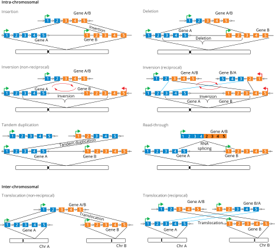

## Overview

Gene fusions often result from large genomic rearrangements such as structural variants. While WGS secondary analysis pipelines typically contain alignment and variant calling stages, very few of them contain dedicated gene fusion callers. When they are included, they are usually associated with RNA-Seq pipelines where gene fusions can be readily observed.

Since gene fusions are frequently observed in cancer and since many sequencing experiments do not include paired RNA-Seq data, we have added gene fusion detection and annotation to Nirvana.

The rich diversity in gene fusion architectures and their likely mechanisms can be seen below:



:::info Publication
Kumar-Sinha, C., Kalyana-Sundaram, S. & Chinnaiyan, A.M. [Landscape of gene fusions in epithelial cancers: seq and ye shall find](https://genomemedicine.biomedcentral.com/articles/10.1186/s13073-015-0252-1). Genome Med 7, 129 (2015)
:::

## Approach

Nirvana uses structural variant calls to evaluate if they form either putative intra-chromosomal or inter-chromosomal gene fusions. 

For each originating transcript, we report the following:
* originating intron or exon number
* for each partner transcript fused with the originating transcript, we report:
  * HGVS coding notation
  * partner intron or exon number

### Variant Types

Specifically we can identify gene fusions from the following structural variant types:
* deletions (`<DEL>`)
* tandem_duplications (`<DUP:TANDEM>`)
* inversions (`<INV>`)
* translocation breakpoints (`AAAAAAAAAAAAAAAAAATTAGTCAGGCAC[chr3:153444911[`) 

### Criteria

The following criteria must be met for Nirvana to identify a gene fusion:
1. Both transcripts must possess a coding region
1. After accounting for genomic rearrangements, both transcripts must have the same orientation
1. Both transcripts must be from the same transcript source (i.e. we won't mix and match between RefSeq and Ensembl transcripts)
1. Both transcripts must belong to different genes
1. Both transcripts cannot have a coding region that already overlaps without the variant (i.e. in cases where two genes naturally overlap, we don't want to call a gene fusion)

:::tip UTR overlap
In the past, we also required that the coding regions from the two genes intersected. However, in oncology literature, there are many documented gene fusions where only the UTRs overlap. As a result, we adjusted our algorithm to allow for UTR overlaps as well.
:::

## ETV6/RUNX1 Example

ETV6/RUNX1 is the most common gene fusion in childhood B-cell precursor acute lymphoblastic leukemia (ALL). Patients with this translocation are associated with a good prognosis and excellent response to treatment.

:::info Publication
Sun C., Chang L., Zhu X. [Pathogenesis of ETV6/RUNX1-positive childhood acute lymphoblastic leukemia and mechanisms underlying its relapse](https://www.oncotarget.com/article/16367/text/). Oncotarget. 2017; 8: 35445-35459
:::

### VCF

Here's a simplified representation of the translocation breakends called by the Manta structural variant caller:

```scss
##fileformat=VCFv4.1
#CHROM  POS     ID      REF     ALT     QUAL    FILTER  INFO
chr12	12026270	.	C	[chr21:36420865[C	.	PASS	SVTYPE=BND
chr12	12026305	.	A	A]chr21:36420571]	.	PASS	SVTYPE=BND
chr21	36420571	.	C	C]chr12:12026305]	.	PASS	SVTYPE=BND
chr21	36420865	.	C	[chr12:12026270[C	.	PASS	SVTYPE=BND
```

#### Interpreting translocation breakends

| REF | ALT  | Meaning                                                    |
|:----|:-----|:-----------------------------------------------------------|
| s   | t[p[ | piece extending to the right of p is joined after t        |
| s   | t]p] | reverse comp piece extending left of p is joined after t   |
| s   | ]p]t | piece extending to the left of p is joined before t        |
| s   | [p[t | reverse comp piece extending right of p is joined before t |

#### Visualization


### JSON Output

The annotation for the first variant in the VCF looks like this:

```json {66,68-100,113,115-123}
    {
      "chromosome": "chr12",
      "position": 12026270,
      "refAllele": "C",
      "altAlleles": [
        "[chr21:36420865[C"
      ],
      "filters": [
        "PASS"
      ],
      "cytogeneticBand": "12p13.2",
      "clingen": [
        {
          "chromosome": "12",
          "begin": 173786,
          "end": 34835837,
          "variantType": "copy_number_gain",
          "id": "nsv995956",
          "clinicalInterpretation": "pathogenic",
          "phenotypes": [
            "Decreased calvarial ossification",
            "Delayed gross motor development",
            "Feeding difficulties",
            "Frontal bossing",
            "Morphological abnormality of the central nervous system",
            "Patchy alopecia"
          ],
          "phenotypeIds": [
            "HP:0002007",
            "HP:0002011",
            "HP:0002194",
            "HP:0002232",
            "HP:0005474",
            "HP:0011968",
            "MedGen:C0232466",
            "MedGen:C1862862",
            "MedGen:CN001816",
            "MedGen:CN001820",
            "MedGen:CN001989",
            "MedGen:CN004852"
          ],
          "observedGains": 1,
          "validated": true
        }
      ],
      "variants": [
        {
          "vid": "12-12026270-C-[chr21:36420865[C",
          "chromosome": "chr12",
          "begin": 12026270,
          "end": 12026270,
          "isStructuralVariant": true,
          "refAllele": "C",
          "altAllele": "[chr21:36420865[C",
          "variantType": "translocation_breakend",
          "transcripts": [
            {
              "transcript": "ENST00000396373.4",
              "source": "Ensembl",
              "bioType": "protein_coding",
              "introns": "5/7",
              "geneId": "ENSG00000139083",
              "hgnc": "ETV6",
              "consequence": [
                "transcript_variant",
                "unidirectional_gene_fusion"
              ],
              "geneFusion": {
                "intron": 5,
                "fusions": [
                  {
                    "hgvsc": "RUNX1{ENST00000437180.1}:c.1_58+274_ETV6{ENST00000396373.4}:c.1009+3367_1359",
                    "intron": 2
                  },
                  {
                    "hgvsc": "RUNX1{ENST00000300305.3}:c.1_58+274_ETV6{ENST00000396373.4}:c.1009+3367_1359",
                    "intron": 1
                  },
                  {
                    "hgvsc": "RUNX1{ENST00000482318.1}:c.1_58+274_ETV6{ENST00000396373.4}:c.1009+3367_1359",
                    "intron": 2
                  },
                  {
                    "hgvsc": "RUNX1{ENST00000486278.2}:c.?_156195_ETV6{ENST00000396373.4}:c.1009+3367_1359",
                    "intron": 2
                  },
                  {
                    "hgvsc": "RUNX1{ENST00000455571.1}:c.1_58+274_ETV6{ENST00000396373.4}:c.1009+3367_1359",
                    "intron": 2
                  },
                  {
                    "hgvsc": "RUNX1{ENST00000475045.2}:c.1_58+274_ETV6{ENST00000396373.4}:c.1009+3367_1359",
                    "intron": 11
                  },
                  {
                    "hgvsc": "RUNX1{ENST00000416754.1}:c.1_58+274_ETV6{ENST00000396373.4}:c.1009+3367_1359",
                    "intron": 2
                  }
                ]
              },
              "isCanonical": true,
              "proteinId": "ENSP00000379658.3"
            },
            {
              "transcript": "NM_001987.4",
              "source": "RefSeq",
              "bioType": "protein_coding",
              "introns": "5/7",
              "geneId": "2120",
              "hgnc": "ETV6",
              "consequence": [
                "transcript_variant",
                "unidirectional_gene_fusion"
              ],
              "geneFusion": {
                "intron": 5,
                "fusions": [
                  {
                    "hgvsc": "RUNX1{NM_001754.4}:c.1_58+274_ETV6{NM_001987.4}:c.1009+3367_1359",
                    "intron": 2
                  }
                ]
              },
              "isCanonical": true,
              "proteinId": "NP_001978.1"
            }
          ]
        }
      ]
    }
```

#### Consequences

When a gene fusion is identified, we add the following Sequence Ontology consequence:

```json {3}
              "consequence": [
                "transcript_variant",
                "unidirectional_gene_fusion"
              ],
```

#### Introns & Exons

In this section we describe all the pairwise gene fusions that obey the criteria outlined above. In the case of `ENST00000396373.4`, there 7 other Ensembl transcripts that would produce a gene fusion. For `NM_001987.4`, there was only one transcript (`NM_001754.4`) that produce a gene fusion.

In each case, Nirvana outputs which intron or exon contained the breakpoint in both of the transcripts that form the gene fusion.

#### HGVS coding notation

Finally, Nirvana also describes the gene fusion using HGVS c. notation:

```json {3}
                "fusions": [
                  {
                    "hgvsc": "RUNX1{NM_001754.4}:c.1_58+274_ETV6{NM_001987.4}:c.1009+3367_1359",
                    "intron": 2
                  }
```

This means that gene fusion uses CDS positions 1-58 from `NM_001754.4` (RUNX1) and CDS positions 1009-1359 from `NM_001987.4` (ETV6). `1009+3367` indicates that the fusion occurred 3367 bp within intron 2.
